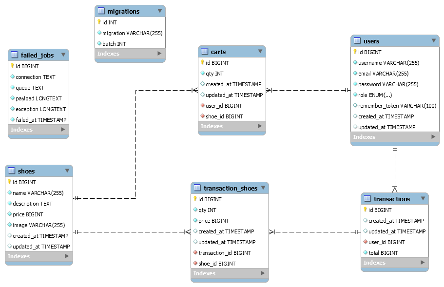

# Just Du It!

Just Du It ! is a famous Indonesian technology company specializing in branded shoes, to expand its business, Just Du
It ! wants to create a website for their shop. This project is the website for the company built using Laravel.

## DB Schema

## How To Run

1. Install all Laravel dependencies using `composer install`
2. Install dependencies for Laravel UI and Bootstrap 4 using `npm install`
3. Run `php artisan storage:link` to enable server storage support
4. Set up your database connections in `.env` file
5. Run `php artisan migrate` to push DB schema to your database of choice
6. Run `php artisan db:seed` to seed admin account example shoes data
7. Start a local server with `php artisan serve`

## Admin Account Access

To enable admin access, make sure you already run all DB seeders using `php artisan db:seed`. You can login to admin
panel with the following credential:

- Email: admin@justduit.com
- Password: 123456

## Author

- I Putu Prema Ananda D.N
